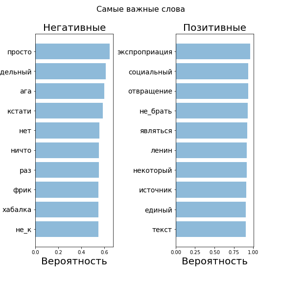
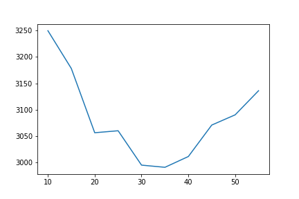

# Overview

In this section, you will learn how to train a model that determines whether an expression is positive or negative.

In the process of achieving this goal, you will learn about the following things:
1. _Preprocessing of data_.
1. _The use of stop words_.
1. _Converting text to numeric characters (vectorization). In this case, you will get acquainted with the algorithms_:
    1. ___Bag of words___ (___BoW___).
    1. ___TF-IDF___.
    1. ___Word2Vec___.
1. _Confusion matrix_.
1. _Latent Dirichlet allocation (LDA)_.

---

## Описание

В данном разделе Вы построите модель, которая, по произвольному тексту, будет определять контекст переданного текста (_негативный_ или _позитивный_).

Для предобработки данных, Вы будете использовать такие вещи как _стоп-слова_, _токенизация_, _нормализация_ и увидите как они влияют на конечный результат.

Также Вы познакомитесь с такой вещью как ___векторизация___ и с методами её реализации (___мешок слов___ (_bag of words - BoW_), ___TF-IDF___, ___Word2vec___, ___Doc2vec___).
Научитесь строить ___матрицу неточностей___ (___confusion matrix___):

Создадите процедуру выявления наиболее значительных слов отражающих _позитивный_ и _негативный_ контексты:

Узнаете, что такое ___латентное размещение Дирихле___ (_Latent Dirichlet allocation_ - _LDA_), зачем оно нужно и как оно может помочь.
Попробуете сгруппировать исходный текст по нескольким темам, а также узнаете как можно найти оптимальное их количество.

Проведёте анализ количества документов которые попали в определённую тему, и создадите процедуру для отображения, через которую будете визуализировать количество _позитивных_ и _негативных_ отзывов в каждой теме.

Пример результата работы **Word2Vec**:

