# ML-Practice

---

## Preparation

To install all the necessary packages, run the following command:
```python
pip install -r path/to/project/requirements.txt
```

---

## Описание

Данный проект поможет Вам приобщиться к _машинному обучению_ (_Machine Learning_).

Здесь Вы познакомитесь с возможностями _машинного обучения_, для каких целей его применяют сегодня, какие алгоритмы применяют и какие библиотеки используют.
Всё это описано здесь.

Данный проект написан на **Python**, а для наглядности результатов используются _тетради_ [_Jupyter Notebook_](https://jupyter-notebook.readthedocs.io).
Подробнее об этом инструменте можно узнать отсюда:
* http://ipython.org/
* https://jupyter.org/
* https://jupyter-notebook.readthedocs.io

Ниже расположен список некоторых библиотек, которые используются в данном проекте:
* [_NumPy_](http://www.numpy.org/): http://www.numpy.org/
* [_Pandas_](http://pandas.pydata.org): http://pandas.pydata.org
* [_Matplotlib_](https://matplotlib.org/): https://matplotlib.org/
* [_Seaborn_](http://seaborn.pydata.org/): http://seaborn.pydata.org/
* [_Plotly_](https://plot.ly/python): https://plot.ly/python
* [_Scikit-learn_](https://scikit-learn.org/stable/): https://scikit-learn.org/stable/
* [_graphviz_](https://graphviz.readthedocs.io): https://graphviz.readthedocs.io
* [_tqdm_](https://github.com/tqdm/tqdm): https://github.com/tqdm/tqdm

Перечисленные библиотеки очень просты в использовании и, для того чтобы их использовать не нужно иметь учёную степень по математике (или другим наукам).
Они существенно облегчают жизнь, когда дело доходит до:
* Представления данных в виде _вектора_ или _таблицы_ (в этом помогает _Pandas_).
* Выполнения математических операций над массивами (в том числе и многомерными массивами) (в этом деле отлично помогает _NumPy_).
* Визуализации данных, построения графиков, интерактивных графиков, анимаций  (здесь отлично справляются _Matplotlib, Seaborn, Plotly_).
* Быстрого тестирования различных алгоритмов машинного обучения (в _Scikit-learn_ это делается очень просто).
* Визуализации графов (для этого очень хоршо подходит _graphviz_).
* Визуализации прогресса с помощью _progressbar'а_ (_tqdm_ имеет очень удобный интерфейс для этого).

В данном проекте используются следующие инструменты и техники:
* Методы предобработки данных (например: _MinMax, OneHotEncoder, Normalize_ и др.).
* **dummy-переменные**
* Алгоритмы уменьшения размерности данных (**PCA, MDS, t-SNE, UMAP**).

Эти инструменты и техники могут существенно улучшить качество Вашей итоговой модели.

В данном проекте Вы узнаете о том, что такое:
* ___Классификация___.
* ___Регрессия___.
* ___Кластеризация___.
* ___Прогнозирование временных рядов___..

И, конечно же, познакомитесь с такими алгоритмами машинного обучения как:
* ___k-ближайших соседей___ (___k-neighbors___)
* ___Линейный SVM___ (___Linear SVM___)
* ___Наивный баес___ (___Naive bayes___)
* ___Решающие деревья___ (___Decision trees___)
* ___Случайный лес___ (___Random forest___)
* ___Нейронные сети___ (___Neural networks___)
* ___Логистическая регрессия___ (___Logistic regression___)

Узнаете о плюсах и минусах каждого алгоритма, какой алгоритм лучше подходит в одних случаях и совершенно не подходит для других.
И, конечно же, узнаете о методах оценки качества созданной модели.

Также в данном проекте описано множество алгоритмов формирования различного рода графиков и анимаций, которые помогают в анализе данных.
Они помогут Вам находить различного рода аномалии, чтобы Вы могли вовремя устранить их (или минимизировать их, возможно, негативный эффект).
Вот, например, некоторые графики:

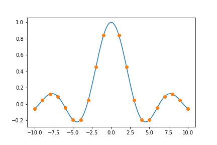

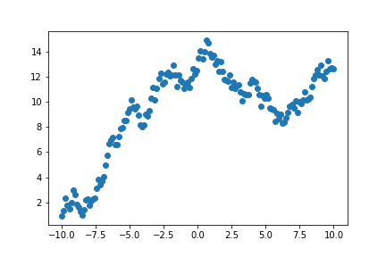

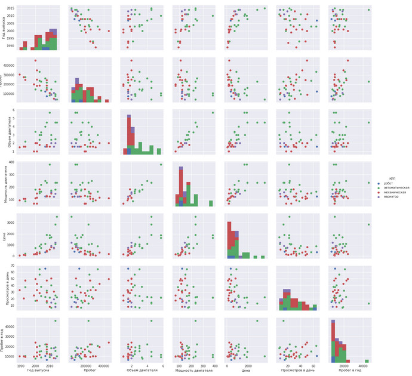

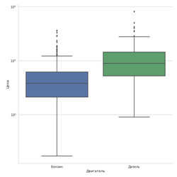


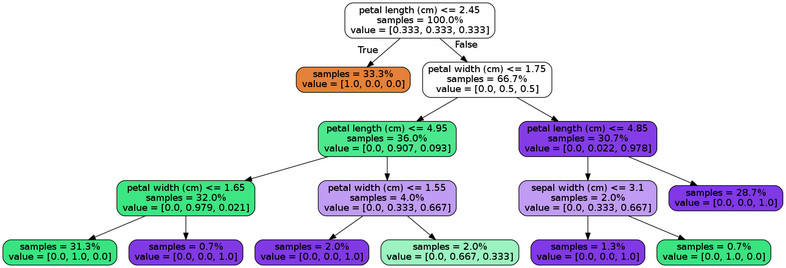

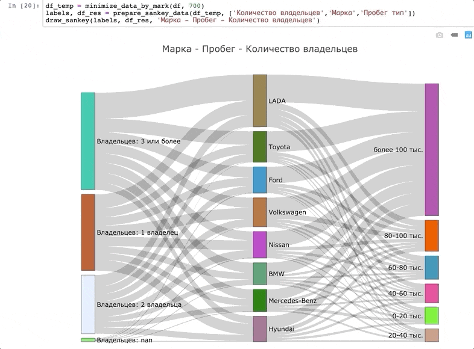

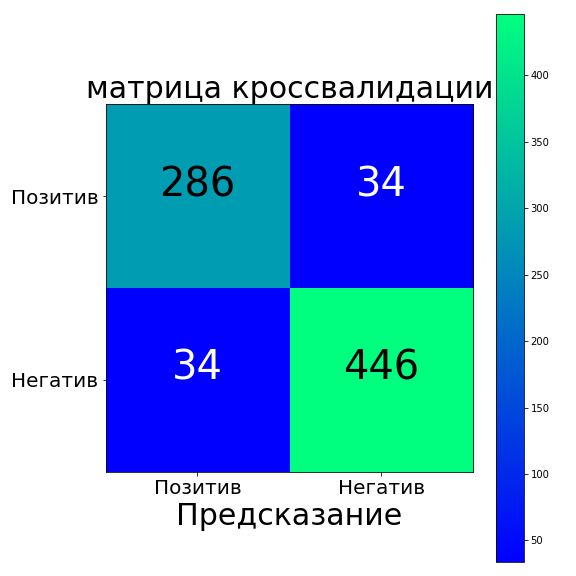


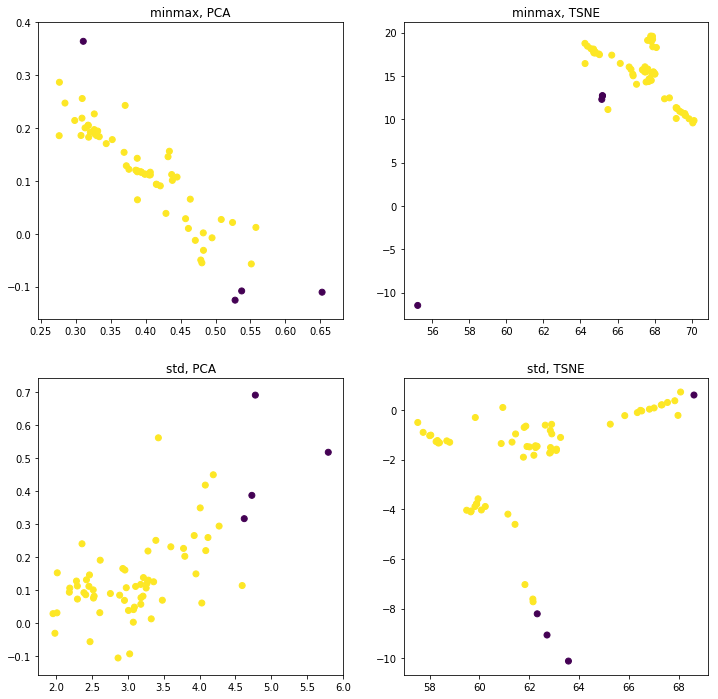

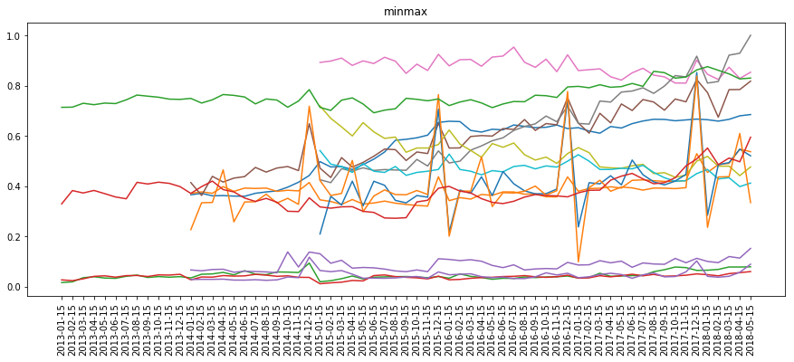

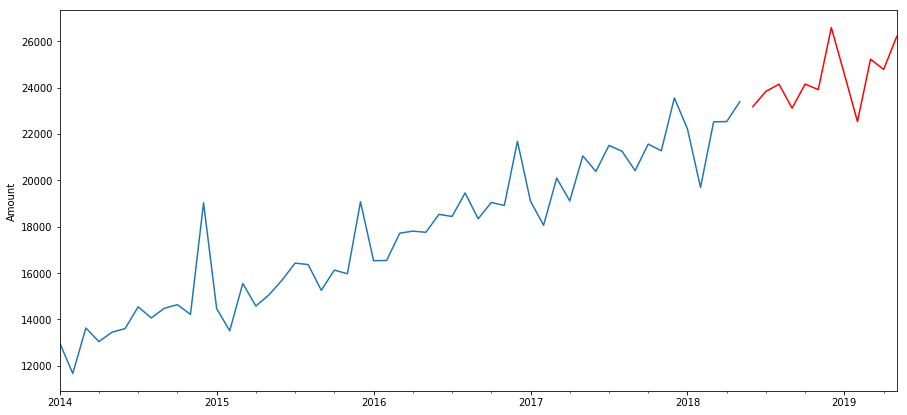

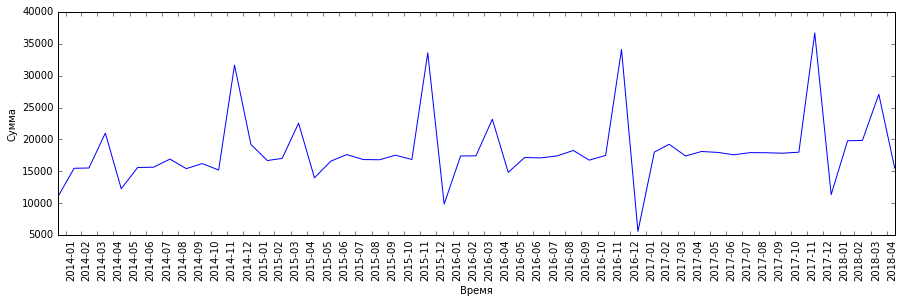
