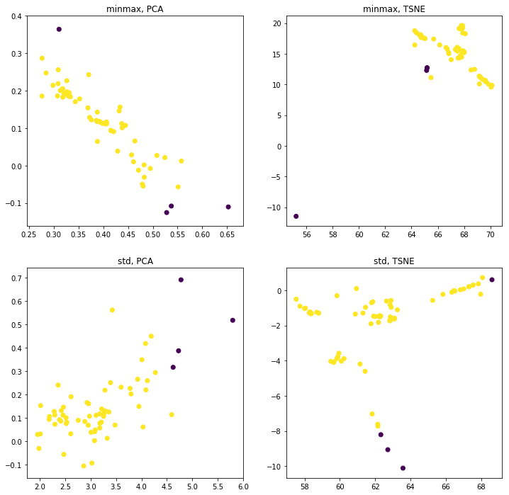
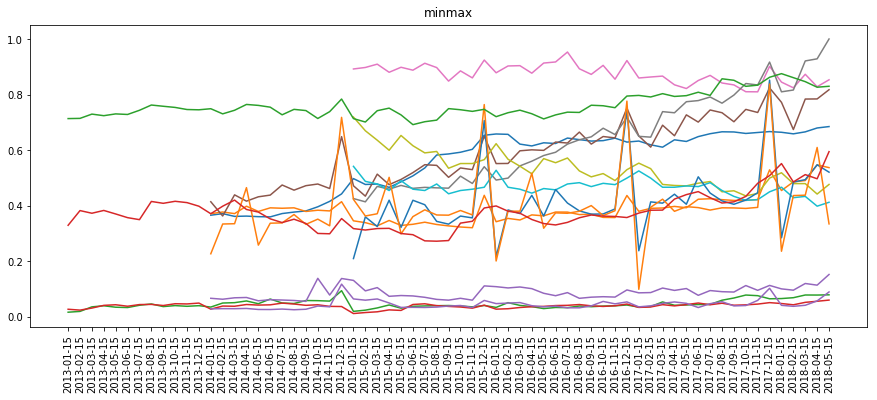

# Overview

This section contains information on anomaly detection in datasets.

---

## Описание

В этом разделе Вы узнаете как можно находить _аномалии_ в данных.
В качестве набора данных используется набор данных _Сбербанка_.

Здесь Вы будете применять такие методы и техники как:
* Кодирование строковых значений (_регионов_) в числовые.
* Преобразования _MinMax_, _StandartScaler_.
* Заполнение пустых значений.
* Уменьшение размерности данных с помощью _principal component analysis_ (_PCA_) и _t-distributed Stochastic Neighbor Embedding_ (_t-SNE_).
* Визуализация данных с помощью _обычных_ и _интерактивных_ графиков.

Ниже показано несколько примеров:

Обнаружение аномалий на плоскости после уменьшения размерности методами _PCA_ и _t-SNE_ для региона _Москва_:

Обнаружение аномалий в начальном пространстве и отображение на плоскости методами _PCA_ и _t-SNE_ для региона _Москва_:

Проверка исходных данных по региону _Москва_:
* _MinMax_:

* _STD_:

Проверка исходных данных по региону _Санкт-Петербург_:
* _MinMax_:

* _STD_:

Пример интерактивного графика:

Пример аномалии на наборе данных **MNIST Fashion**:

