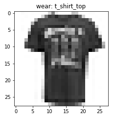
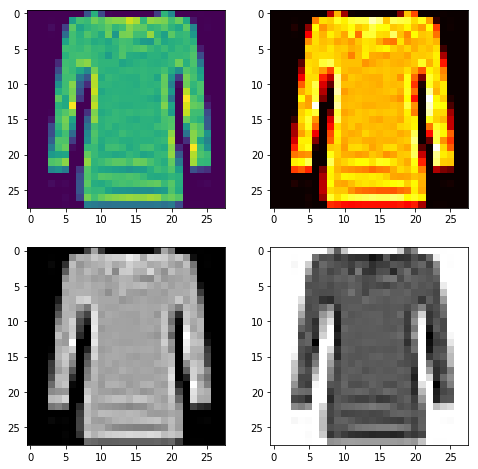
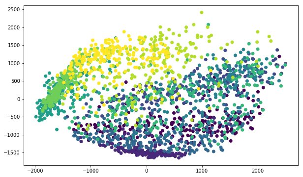
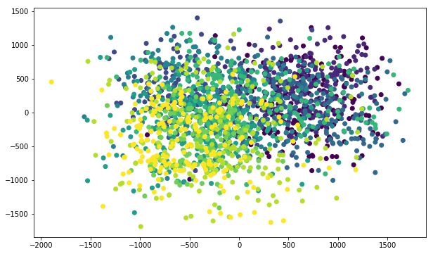
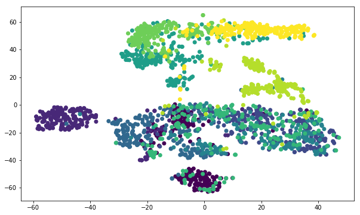
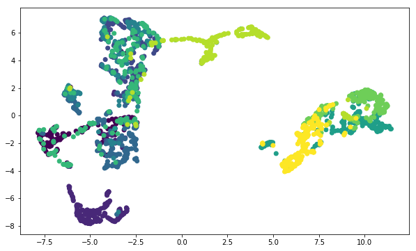
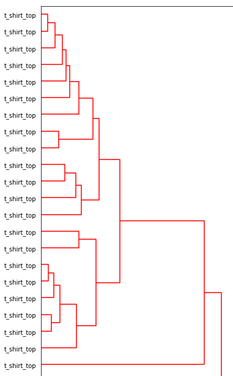
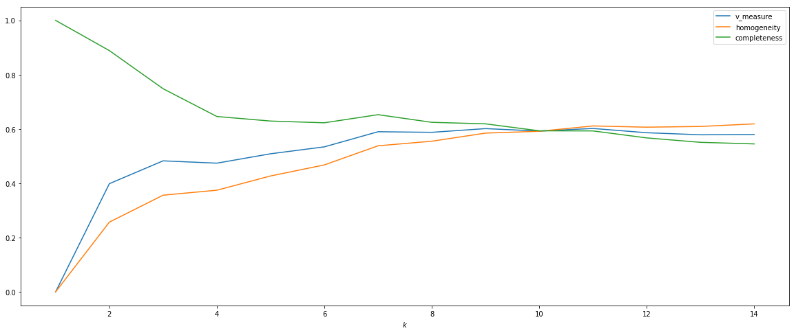
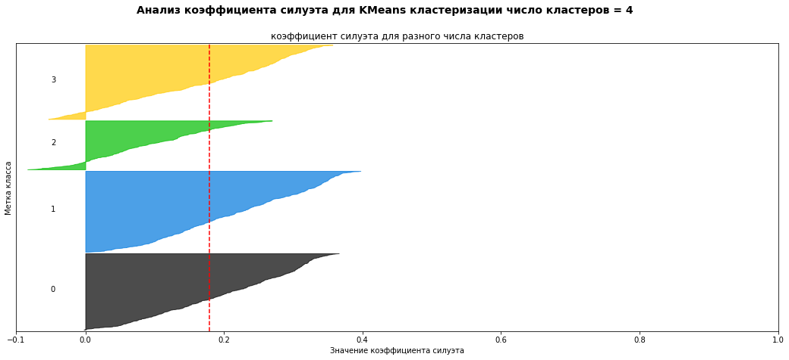

# Overview
---

This section contains information about **clustering** on the example of an interesting data set - **MNIST-Fashion**.
It will also consider ways to reduce the dimension of space with the help of such tools as:
1. **PCA**
1. **Multidimensional scaling (MDS)**
1. **t-SNE**
1. **Uniform Manifold Approximation and Projection (UMAP)**

## Preparations
---

Before you run it, you should check and, if necessary, change the paths in the following files:
>1. Configs\MNIST_Fashion\configs.py:  
    - `ROOT_DIR` (full path to the folder with the main file).  
>
>2. Configs\MNIST_Fashion\helper.py:  
    - You must specify the path to the file "**configs.py**", from which the necessary variables are taken (`LOG_PATH`, `ROOT_DIR`, `ENABLE_LOGS`, etc.).

---

## Описание

В этом разделе Вы познакомитесь с таким набором данных как **MNIST Fashon**.
Это тот же самый **MNIST**, только вместо цифр используются предметы гардероба (_пальто, футболки, кеды, сумки и т.п._):

Здесь Вы узнаете о нескольких вариантах цветовых отображений:

Также Вы познакомитесь с такой полезной техникой как ___уменьшение размерности___ (___dimensionality reduction___).
Здесь находится несколько примеров _уменьшения размерности_ с применением таких алгоритмов как:
* ___Principal Component Analysis___ (___PCA___) - ___Метод главных компонент___.
* ___Multidimensional Scaling___ (___MDS___) - ___Многомерное шкалирование___.
* ___t-Distributed Stochastic Neighbor Embedding___ (___t-SNE___) - ___Стохастическое вложение соседей с t-распределением___.
* ___Uniform Manifold Approximation and Projection___ (___UMAP___).

Примеры работы алгоритмов _уменьшения размерности_:

**PCA**:

**MDS**:

**t-SNE**:

**UMAP**:

Здесь Вы научитесь визуализировать данные в виде _дендрограммы_:

В этом разделе Вы научитесь вычислять такие метрики качества как:
* ___homogeneity___
* ___completeness___
* ___V-Measure___

Также Вы изобразите график зависимости значений этих метрик от количества кластеров и проследите за тем как меняются показатели _homogeneity, completeness, V-Measure_ с ростом числа кластеров:

В конце данного раздела Вы познакомитесь с таким понятием как ___коэффициент силуэта___ (___silhouette___) и узнаете для чего он нужен:

