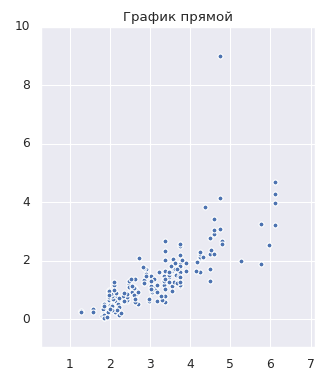

# Overview

Here you will learn what polynomial transformations are and learn the advantages of their use in regression problems.

You will also learn what **Gradient descent**, **Stochastic gradient descent** and **mini batch gradient descent** are and what they are for.

---

## Описание

В данном разделе находятся 2 модуля:
1. В модуле ___p-polynom___ рассказывается про _полиномиальные преобразования_ для задачи регрессии.
1. В модуле ___p-gradient___ рассказывается про ___градиентный спуск___ и его разновидности.

В первом модуле Вы познакомитесь с _полиномиальными преобразованиями_ для задачи регрессии.
А если быть точнее, то задачей является создание модели, которая будет определять стоимость новой машины (с пробегом менее _2000 км_) с определённым типом кузова (в примере это **седан**).
Вы узнаете как реализованы _полиномиальные преобразования_ и как они повлияют на конечный результат.

Второй модуль более интересный.
В нём Вы познакомитесь с методом ___градиентного спуска___ (___gradient descent___) и его разновидностями:
* ___Стохастический градиентный спуск___ (___stochastic gradient descent___).
* ___Градиентный спуск по минибатчам___ (___minibatch gradient descent___).

Помимо этого Вы познакомитесь с процессом создания графиков с анимацией:

**Градиентный спуск**

**Стохастический градиентный спуск**

**Градиентный спуск по минибатчам**

