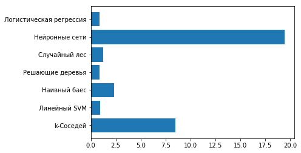
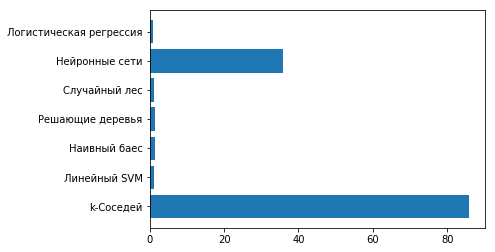
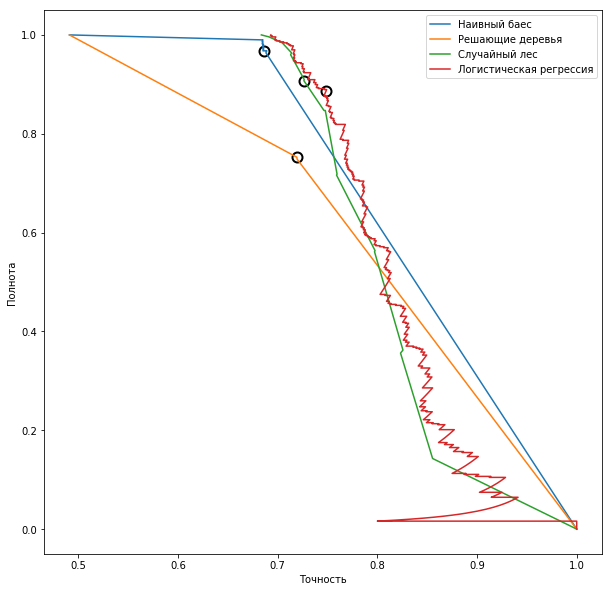
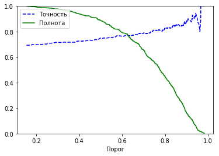

# Overview

In this section you will learn how to design and select features, as well as select values for model hyperparameters.
Get acquainted with industrial solutions in the field of machine learning such as **XGBoost** and **CatBoost**.
Here we take a closer look at the work with the "_Scikit-learn_" library and get acquainted with the machine learning algorithms it provides, such as:
1. _k-neighbors_
1. _Linear SVM_
1. _Naive bayes_
1. _Decision trees_
1. _Random forest_
1. _Neural networks_
1. _Logistic regression_

---

## Описание

В данном разделе Вы построите модель, которая, будет определять является ли объявление _популярным_ или _непопулярным_.
Вы познакомитесь с методами разделения выборки на несколько частей, и узнаете как, и чем, лучше заполнять пропущенные данные.
Вы познакомитесь с понятием ___дискретизация___, а также узнаете о способах преобразования непрерывной величины к категориальным классам.

Вы будете использовать метод `pandas.DataFrame.sample()`, который позволяет перемешивать данные:
```python
>>> df = pd.DataFrame({'num_legs': [2, 4, 8, 0],
...                    'num_wings': [2, 0, 0, 0],
...                    'num_specimen_seen': [10, 2, 1, 8]},
...                   index=['falcon', 'dog', 'spider', 'fish'])
>>> df
        num_legs  num_wings  num_specimen_seen
falcon         2          2                 10
dog            4          0                  2
spider         8          0                  1
fish           0          0                  8


>>> df['num_legs'].sample(n=3, random_state=1)
fish      0
spider    8
falcon    2
Name: num_legs, dtype: int64


>>> df.sample(frac=0.5, replace=True, random_state=1)
      num_legs  num_wings  num_specimen_seen
dog          4          0                  2
fish         0          0                  8
```

Здесь Вы узнаете как можно преобразовать `pandas.DataFrame` в ___массив признаков___.
Познакомитесь с понятием ___dummy-кодирование___ и узнаете в каких случаях его следует применять.
Также, Вы узнаете как, с помощью одной инструкции создать, и сразу же заполнить, колонку содержащую количество символов в объявлении.

Здесь Вы увидите методы, с помощью которых можно находить те признаки, от которых зависит целевая переменная **Y**.

Также, в этом задании, Вы будете использовать такие алгоритмы как:
* _k-ближайших соседей_
* _Линейный SVM_
* _Наивный баес_
* _Решающие деревья_
* _Случайный лес_
* _Нейронные сети_
* _Логистическая регрессия_

Кстати, здесь Вы узнаете как можно запустить несколько алгоритмов в одном цикле и научитесь вычислять время выполнения каждого алгоритма.
В этом задании мы попробуем каждый из этих алгоритмов со значениями по умолчанию и сравним результат.
```python
names = ["k-Соседей",
         "Линейный SVM", "Наивный баес",
         "Решающие деревья", "Случайный лес", "Нейронные сети", "Логистическая регрессия"]

classifiers = [
    KNeighborsClassifier(),
    LinearSVC(),GaussianNB(),DecisionTreeClassifier(),
    RandomForestClassifier(),MLPClassifier(hidden_layer_sizes=(50,)),LogisticRegression()]

scores=[]
scores_train=[]
times=[]

for name, clf in zip(names, classifiers):
    start_time = time.time()
    clf.fit(X_train, y_train)
    y_predicted = clf.predict(X_test)
    scores.append( accuracy_score(y_predicted, y_test) )
    scores_train.append( accuracy_score(clf.predict(X_train), y_train) )
    times.append(time.time() - start_time)
```



Вы узнаете как и чем заполнять пустые значения у категориальных и вещественных признаков.
Также Вы увидите как количество признаков влияет на скорость работы алгоритмов.
Вот, например, время работы алгоритмов для данных с **11 699** признаками:



Вы узнаете, что такое ___интерполяция___ и как она помогает заменять пустые значения в числовых признаках,
и научитесь легко преобразовывать числовые данные к данным в отрезке **(0, 1)**.

Вы познакомитесь с ___методом отбора признаков на основании модели___, и примените его на алгоритме "_Случайный лес_",
а потом воспользуетесь ___методом поиска гиперпараметров___ (___gridsearch___) (поиск наилучших параметров для определённого алгоритма).

Также Вы познакомитесь и примените на практике такие промышленные решения (которые позволяют, в том числе, использовать **GPU**) как:
* ___XGBoost___.
* ___CatBoost___.

Также Вы научитесь проводить ___анализ точности и полноты___ различных моделей с помощью графика:



И научитесь строить ___график зависимости точности и полноты от порога___:


