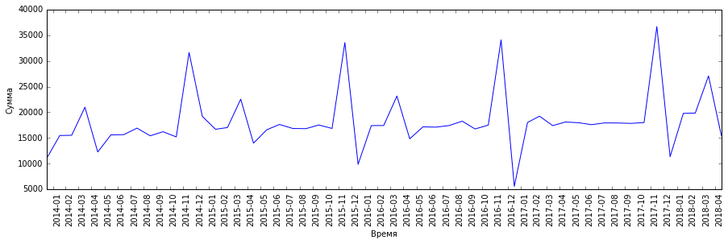
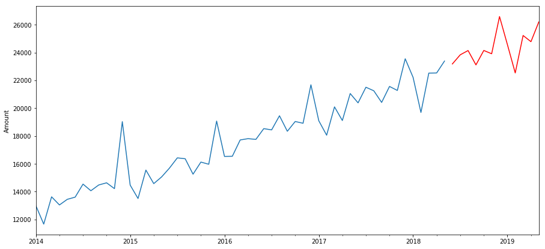

# Overview

In this section you will learn how to build a model based on **time series**.
On the way to this goal, we will consider the following things:
1. **Autoregression**, in particular, we will use the ___autoregressive integrated moving average___ (___ARIMA___) model.
1. The **stabilization** of the **dispersion**.
1. **Stationarity**.
1. Using of **Random forest** and **Linear regression models**

---

## Описание

В этом разделе содержится информация о _прогнозировании временных рядов_.
Здесь есть 2 модуля:
1. Прогнозирование с помощью уже известных моделей (___случайный лес___ (___random forest___), ___линейная регрессия___ (___linear regression___)).
1. Прогнозирование с помощью новой модели ___ARIMA___.

В обоих модулях цель одинаковая и описана ниже, отличия будут только в колонках прогнозирования.

> Цель:
> по имеющимся данным _Сбербанка_ необходимо построить модель, которая могла бы, наиболее точно, прогнозировать результат на ближайшие месяцы.

В первом модуле нужно построить модель, которая прогнозирует _среднюю пенсию_ в регионе _Москва_:

А во втором модуле нужно построить модель, которая будет делать прогноз по _среднему расходу по картам_ в регионе _Москва_:

В первом модуле описывается применение следующих алгоритмов:
* ___Случайный лес___ (___Random forest___).
* ___Линейная регрессия___ (___Linear regression___).

В обоих модулях Вы увидите способы манипулирования данными для улучшения прогнозов моделей.
Например:
1. Использование разных признаков:

**Признак _POSIX-время_**:

**Признак _месяц_**:

2. Использование _dummy-переменных_:

**Без _dummy-переменных_**:

**С _dummy-переменными_**:

Во втором модуле Вы познакомитесь с _моделью авторегрессии - скользящего среднего_ (моделью и методологией анализа _временных рядов_) ___Autoregressive Integrated Moving Average___ или в сокращённом варианте - ___ARIMA___ (также известна как ___модель Бокса-Дженкинса___).

Также Вы узнаете о таких явлениях как ___тренд___ и ___сезонность___.

В этом модуле Вы узнаете, что такое ___стационарный ряд___, и как понять, что ряд является _стационарным_.
И познакомитесь с ___критерием Дики-Фуллера___, который помогает в определении _стационарности_ ряда:

Познакомитесь с таким методом _стабилизации_, имеющегося ряда, как ___преобразование Бокса-Кокса___:

В конце Вы узнаете о таком полезном критерии как ___информационный критерий Акаике___ (___AIC___).
Данный критерий помогает найти такую модель, которая будет, достаточно, хорошо описывать данные и содержать не слишком большое кол-во параметров.

